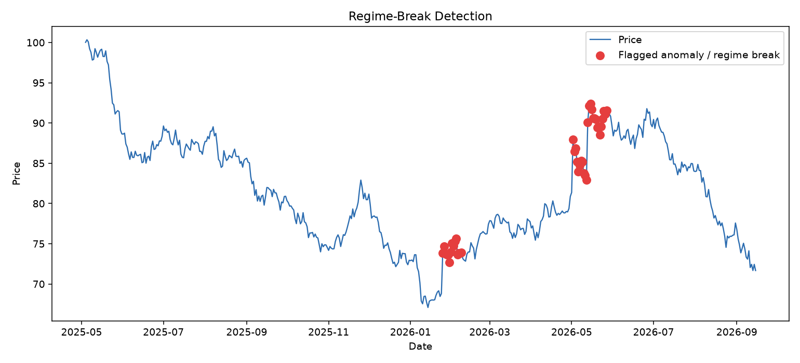
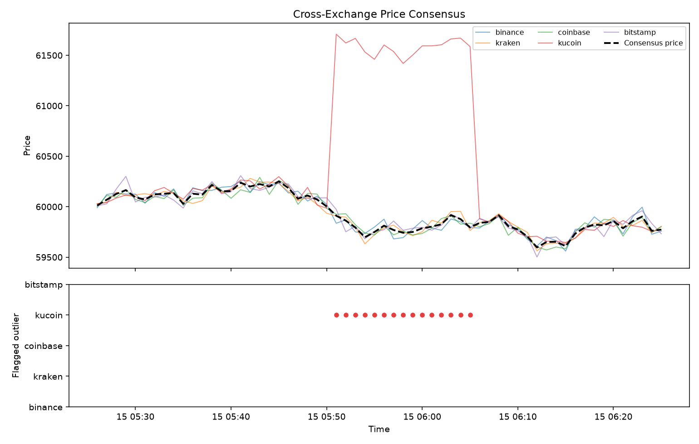
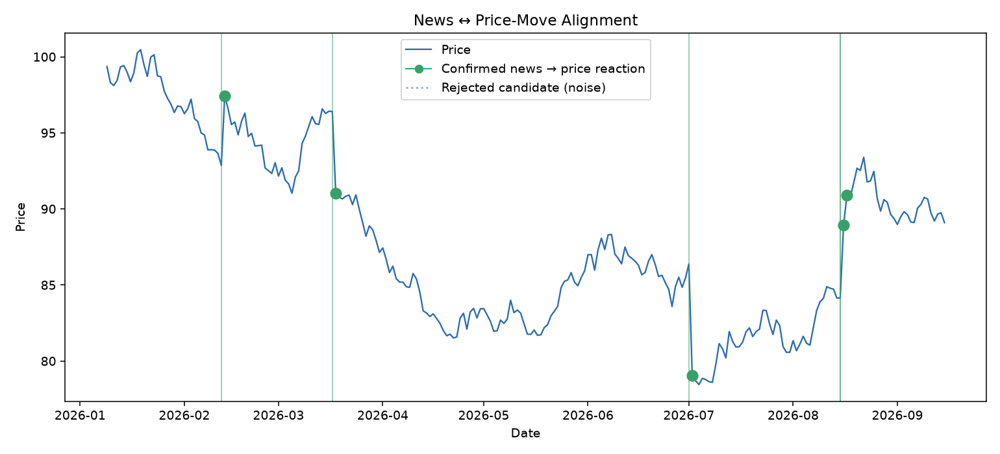

# TrueWind

**Robust anomaly detection for financial markets, built on a graph-theoretic consensus algorithm originally designed for robot perception.**

[](https://github.com/Hussmart/truewind/actions/workflows/tests.yml)


## The idea

[CLIPPER](https://github.com/mit-acl/clipper) (Lusk, Fathian & How, MIT Aerospace Controls Lab, ICRA 2021) is a robotics library that solves **robust data association**: given a set of noisy candidate matches between two point clouds, find the largest subset that is mutually geometrically consistent — and throw out everything else as an outlier, with provable guarantees. It does this by relaxing the underlying maximum-clique problem to a continuous optimization over a weighted graph and solving it with projected gradient ascent.

That formulation has nothing to do with point clouds specifically — it's a general recipe for **"given noisy pairwise agreement scores, find the largest mutually-consistent subset."** TrueWind reimplements the same relaxation in pure Python/numpy (see [`truewind/consensus.py`](truewind/consensus.py)) and applies it to two financial data-association problems instead:

1. **Regime-break / anomaly detection** in a single price series
2. **Cross-exchange price-consensus** — flagging venues whose quote disagrees with the group
3. **News ↔ price-move alignment** — the financial analogue of CLIPPER's *original* point-cloud registration setup

This is a from-scratch, from-first-principles reimplementation of CLIPPER's core relaxation, *not* a wrapper around the original C++ library — credit and citation to the original authors below.

## 1. Regime-break detection

Rolling windows of returns are turned into nodes of a consistency graph (nodes agree if their local mean/volatility are statistically close). The solver finds the largest mutually-consistent set of windows — the "normal regime" — and flags everything left out.

```bash
python examples/regime_demo.py --save          # synthetic data, offline
python examples/regime_demo.py --ticker AAPL   # real data via yfinance
```



## 2. Cross-exchange price-consensus

At each timestamp, each exchange's quoted price is a node; nodes agree if their prices are close relative to the group. The solver finds the consensus "true price" cluster — any exchange left out is flagged (stale book, thin liquidity, or a wash-trading / manipulation candidate).

```bash
python examples/exchange_demo.py --save                    # synthetic panel, offline
python examples/exchange_demo.py --live --symbol BTC/USDT  # live snapshot via ccxt
```



In the synthetic demo above, one exchange (`kucoin`) is biased +3% for a window of time — the detector flags exactly that exchange, with zero false positives on the others.

## 3. News ↔ price-move alignment

This is the closest analogue to what CLIPPER was originally built for. In point-cloud registration, a candidate point-to-point correspondence is consistent with another correspondence if the distance between the two points is preserved under a common rigid transform. Here, a candidate (news event → price jump) pair is consistent with another if both imply a **similar reaction lag** — real news-driven moves react with a roughly constant delay, while coincidental pairings have random, inconsistent lags. Candidates that would double-assign the same news item or the same price jump are also marked inconsistent (mirroring point-cloud registration's one-to-one matching constraint).

```bash
python examples/news_price_demo.py --save
```



In the synthetic demo above, 4 news events are genuinely causal and 10 are unrelated noise; the consensus solver confirms only the news → price-jump pairs with a mutually consistent reaction lag, correctly recovering the genuine events.

## Dashboard

An interactive Streamlit dashboard covers all three modules:

```bash
pip install -e ".[dashboard]"
streamlit run dashboard/app.py
```

## Why not just use z-scores / Isolation Forest?

You can, and for many cases you should — this isn't a replacement for standard anomaly detection. The difference is what "normal" means: classic outlier detectors compare each point to a *global* statistic (mean, a fitted density). The consensus approach instead asks "what is the largest *mutually agreeing* subset of the data" — which is naturally robust when a large minority of points are simultaneously wrong (e.g. a correlated shock across several windows, or several exchanges briefly agreeing on a stale price), a case where distance-to-global-mean methods degrade.

## Install

```bash
python -m venv .venv
source .venv/bin/activate   # .venv\Scripts\activate on Windows
pip install -r requirements.txt
pip install -e .
```

## Project layout

```
truewind/
  consensus.py             # core consensus-maximization solver (the "CLIPPER" part)
  regime.py                # module 1: regime-break / anomaly detection
  exchange_consensus.py    # module 2: cross-exchange price consensus
  news_price_alignment.py  # module 3: news <-> price-move alignment
  viz.py                   # matplotlib helpers
  data/                    # live (yfinance/ccxt) + synthetic data generators
dashboard/app.py            # Streamlit dashboard over all three modules
examples/                   # runnable demo scripts
tests/                       # pytest suite (synthetic ground-truth checks)
```

## Tests

```bash
pytest -v
```

Tests validate the solver against synthetic graphs/series with a known, injected ground truth (a planted clique of consistent nodes plus outliers; a price series with injected shocks; an exchange panel with one biased venue) rather than asserting on live market data.

## Roadmap / ideas for contribution

- [ ] Robust correlation clustering for pairs-trading candidate selection
- [ ] Plug a real sentiment model (e.g. FinBERT) into the news ↔ price alignment module instead of a signed label
- [ ] Benchmark against Isolation Forest / z-score baselines on labeled anomaly datasets
- [ ] Historical (not just live-snapshot) cross-exchange backtesting via exchange APIs' OHLCV history

Issues and PRs welcome.

## Credit

The consensus-maximization idea is directly inspired by:

> P. C. Lusk, K. Fathian, J. P. How, "CLIPPER: A Graph-Theoretic Framework for Robust Data Association," *IEEE International Conference on Robotics and Automation (ICRA)*, 2021. [[paper]](https://arxiv.org/abs/2011.10202) [[original repo]](https://github.com/mit-acl/clipper)

This project does not use or redistribute any code from the original repository — it's an independent, from-scratch reimplementation of the relaxation applied to a different problem domain.

## License

MIT — see [LICENSE](LICENSE).
